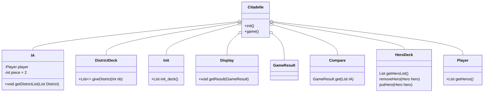

```mermaid

classDiagram
    Citadelle o-- IA
    Citadelle o-- DistrictDeck
    Citadelle o-- Init
    Citadelle o-- Display
    Citadelle o-- GameResult
    Citadelle o-- Compare
    Citadelle o-- HeroDeck
    Citadelle o-- Player
            
    class Citadelle{
        +init()
        +game()
    }

    class Player{
        +List<Hero> getHeros()
    }

    class IA{
      -Player player
      -int piece = 2
      +void getDistrictList(List District)
    }

    class DistrictDeck{
      +List<> giveDistrict(int nb)
    }

    class Init{
        +List<District> init_deck()
    }

    class Display{
      +void getResult(GameResult)
    }

    class GameResult{

    }

    class Compare{
        GameResult get(List IA)
    }

    class HeroDeck{
        List<Hero> getHeroList()
        removeHero(Hero hero)
        putHero(Hero hero)
    }       

```