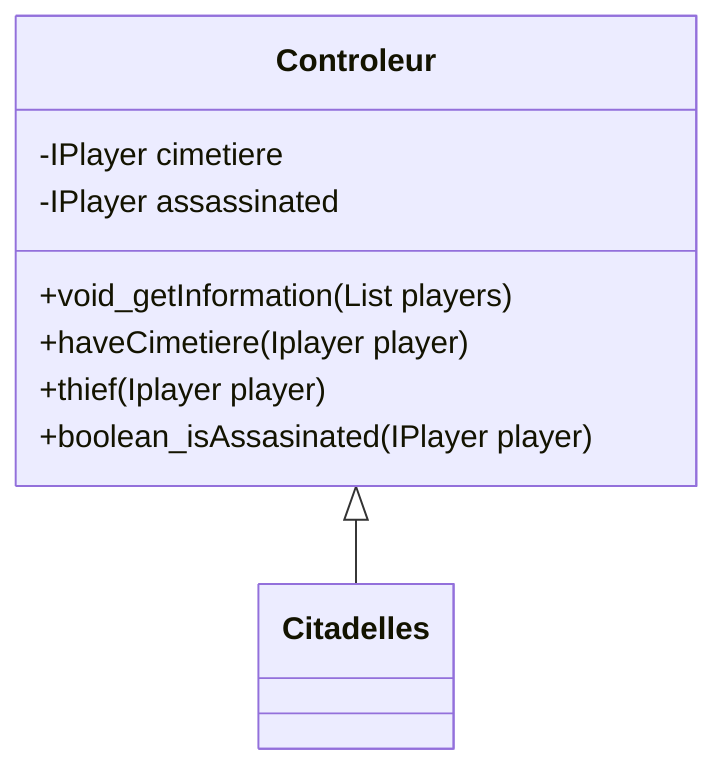

```mermaid

classDiagram
Controleur <|-- Citadelles

    class Controleur{
      -IPlayer cimetiere
      -IPlayer assassinated

      +void_getInformation(List<IPlayer> players)
      +haveCimetiere(Iplayer player)
      +thief(Iplayer player)
      +boolean_isAssasinated(IPlayer player)
    } 

``` 