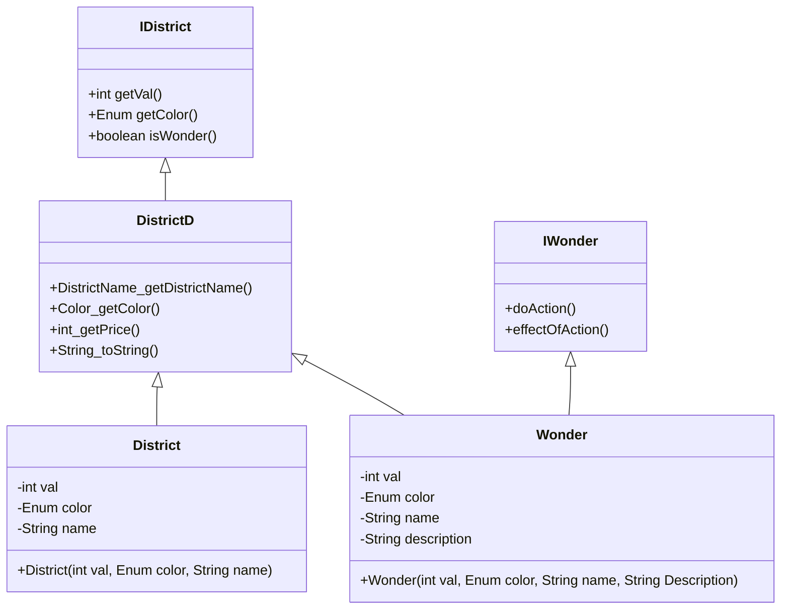

```mermaid

classDiagram
IDistrict <|-- DistrictD
DistrictD <|-- District
IWonder   <|-- Wonder
DistrictD <|-- Wonder

    class DistrictD{
        +DistrictName_getDistrictName( )
        +Color_getColor() 
        +int_getPrice()
        +String_toString()
    }

    class IDistrict{
      +int getVal()
      +Enum getColor()
      +boolean isWonder()
    }
    
    class District{
      -int val
      -Enum color
      -String name
      +District(int val, Enum color, String name)
    }

    class Wonder{
        -int val
        -Enum color
        -String name
        -String description
        +Wonder(int val, Enum color, String name, String Description)
    }

    class IWonder{
      +doAction()
      +effectOfAction()
    }
    
```     