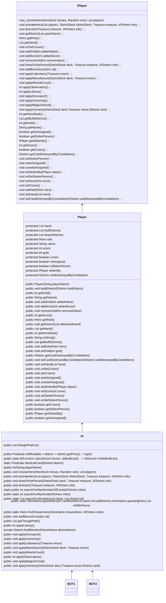

```mermaid

classDiagram
  IPlayer <-- Player
  Player <-- IA
  IA <-- BOT1
  IA <-- BOT2

  class IPlayer{
    void_chooseHero(HeroDeck heroes, Random rand, List<IPlayer> players)
     void activateHero(List<IPlayer> players, DistrictDeck districtDeck, Treasure treasure, IAToHero info);
    void doAction(Treasure treasure, IAToHero info);
    void getDistrict(List<IDistrict> giveDistrict);
    IHero getRole();
    List<IDistrict> getHand();
    void unSetCrown();
    void addGold(int addedValue);
    void addScore(int addedScore);
    void removeGold(int removevalue);
    void drawOrGetPieces(DistrictDeck deck, Treasure treasure, IAToHero info);
    void addBonusScore(int val);
    void applyLaboratory(Treasure tresor);
    void applyManufacture(DistrictDeck deck, Treasure tresor);
    void applyMiracleCourt();
    int applyObservatory();
    int applyLibrary();
    void applyDrocoport();
    void applyUniversity();
    void applyMagicSchool();
    void applyCemetry(DistrictDeck deck,Treasure tresor,IDistrict card);
    int getHeroRank();
    List<IDistrict> getBuiltDistricts();
    int getGold();
    String getName();
    boolean getIsAssigned();
    boolean getStolenPerson();
    IPlayer getStolenBy();
    int getScore();
    boolean getCrown();
    IDistrict getCardDestroyedByCondottiere();
    void setStolenPerson();
    void setIsAssigned();
    void unsetIsAssigned();
    void setStolenBy(IPlayer player);
    void unSetStolenPerson();
    void setScore(int score);
    void setCrown();
    void setRole(IHero hero);
    void setHand(List<IDistrict> hand);
    void setCardDestroyedByCondottiere(IDistrict cardDestroyedByCondottiere);
  }

  class Player{
        protected List<IDistrict> hand;
    protected List<IDistrict> builtDistricts;
    protected List<IDistrict> drawnDistricts;
    protected IHero role;
    protected String name;
    protected int score;
    protected int gold;
    protected boolean crown;
    protected boolean isAssigned;
    protected boolean isStolenPerson;
    protected IPlayer stolenBy;
    protected IDistrict cardDestroyedByCondottiere;

    public Player(String playerName)
    public void buildDistrict(IDistrict builtDistrict)

    public int getGold()
    
    public String getName()

    public void addGold(int addedValue)

    public void addScore(int addedScore)

    public void removeGold(int removedValue)

    public int getScore()

    public IHero getRole()

    public void getDistrict(List<IDistrict> attributedHand)

    public List<IDistrict> getHand()

    public int getHeroRank()

    public String toString()

    public List<IDistrict> getBuiltDistricts()

    public void setRole(IHero hero)

    public void setGold(int gold)

    public IDistrict getCardDestroyedByCondottiere()

    public void setCardDestroyedByCondottiere(IDistrict cardDestroyedByCondottiere)

    public void setHand(List<IDistrict> hand)

    public void unSetCrown()

    public void setCrown()

    public void setIsAssigned()

    public void unsetIsAssigned()

    public void setStolenBy(IPlayer player)

    public void setScore(int score)

    public void setStolenPerson()

    public void unSetStolenPerson()

    public boolean getCrown()

    public boolean getStolenPerson()

    public IPlayer getStolenBy()

    public boolean getIsAssigned()

  }

  class IA{
    public List<HerosChoice> thoughtPathList;
    public Predicate<IDistrict> isAffordable = district -> district.getPrice()<=gold ;
    public static BiFunction<Integer ,Integer,Integer > calculScore=(score, nbBuiltCard)->  100*score+10*nbBuiltCard;
    static Predicate<IDistrict> identicalCard(IDistrict district)
    public IA(String playerName)
    public void chooseHero(HeroDeck heroes, Random rand, List<IPlayer> players)
    public void activateHero(List<IPlayer> players, DistrictDeck districtDeck, Treasure treasure, IAToHero info ) 
    public void drawOrGetPieces(DistrictDeck deck, Treasure treasure, IAToHero info)
    public void doAction(Treasure treasure, IAToHero info)
    static public int searchForMaxNumberOfCards(IAToHero infos)
    public static int searchForMaxGold(IAToHero infos)
    public static List<IDistrict> searchForDoubles(List<IDistrict> hand, List<IDistrict> districtList)
    public static HeroName guessHero(int CardNumber,int gold,List<IDistrict> builtDistricts,HeroName guessingHero,List<HeroName> visibleHeros)
    public static IHero findChosenHero(HeroName chosenHero, IAToHero infos)
    public void addBonusScore(int val)
    public List<HerosChoice> getThoughPath()
    public int applyLibrary()
    private IDistrict findWonder(DistrictName districtName)
    public void applyDrocoport()
    public void applyUniversity()
    public void applyLaboratory(Treasure tresor)
    public void applyManufacture (DistrictDeck deck, Treasure tresor)
    public void applyMiracleCourt()
    public int applyObservatory()
    public void applyMagicSchool()
    public void applyCemetry(DistrictDeck deck,Treasure tresor,IDistrict card)
  }

  class BOT1{

  }

  class BOT2{
    
  }
```