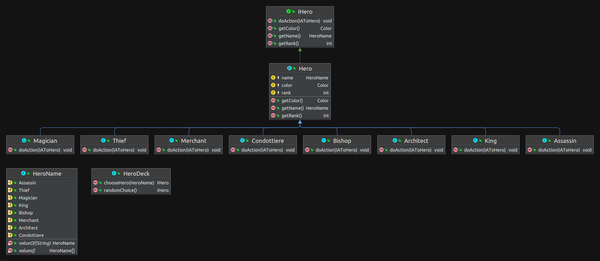
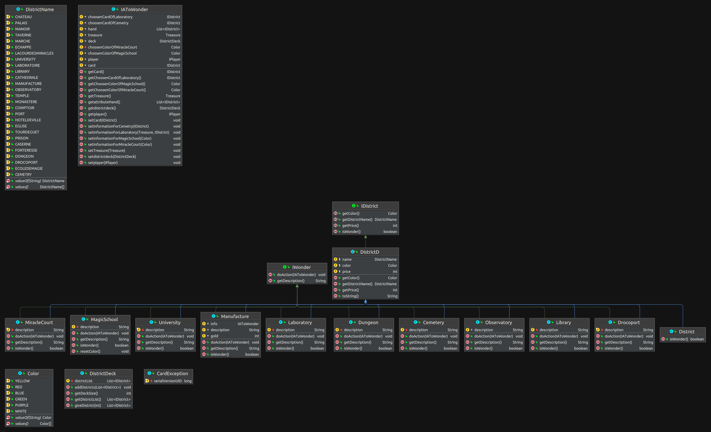
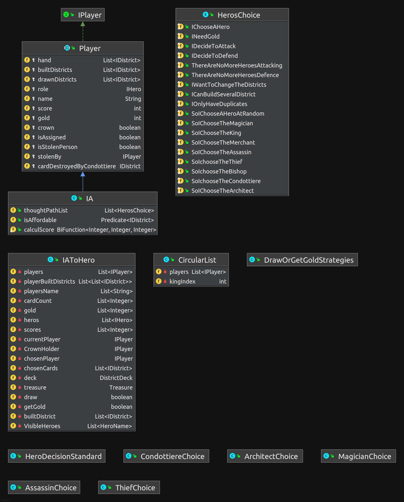

# Sommaire
1. [Rétrospective](#etape1)
   1. [Réussi](#etape11)
   2. [Raté](#etape12)
   3. [A Conserver](#etape13)
   4. [A Changer](#etape14)
2. [RAPPORT](#etape2)
   1. [Architecture](#etape21)
      1. [L'architecture des Heros](#etape211)
      2. [L'architecture des Districts et Wonders](#etape212)
      3. [L'architecture des Players](#etape213)
   2. [Qui est responsable de quoi / qui a fait quoi ?](#etape22)
   3. [Process de l'équipe](#etape23)
   4. [Avancement sur les fonctionnalités](#etape24)

# Rétrospective <a name="etape1"></a>

## Réussi : <a name="etape11"></a>
* Architure cohérente avec l’idée de base (On a fait attention à la modularité de notre logiciel).
* A avoir une certaine régularité dans les rendez-vous dans la semaine
* On estime avoir un code de bonne qualité (Testé + Mockito + Modularité + Lisibilité + Code commenté )
* Bonne arborescence dans les fichiers du projet. (Chaque type de classe correspond à un package)
* Code maintenable : Modularité, visibilité
* Logiciel répondant au cahier des charges

## Raté : <a name="etape12"></a>

* Procrastination de la mise en place de l’architecture d’utilisation des merveilles.
* Ordre du jour des reus pas toujours respecté (Parler de plusieurs sujets en même temps)
* <p style='text-align: justify;'> Communication sur messenger mal exploité. Toutes les informations utiles pour le groupe et les informations personnelles sont noyées. (Exemple il suffit d’un jour sans la lecture de messenger pour perdre le fil et avoir des difficultée à traiter les données) Solution -> Privilégier les informations de groupe en faisant une synthèse sur la convesation de groupe, et utiliser des canaux privés pour des échanges avec une personne concernée. </p>
* <p style='text-align: justify;'> Répartition des tâches -> Les classes avec beaucoup de complexité n’ont pas été bien réparties. Résultat, pour la personne n’ayant pas beaucoup touchée la classe, il est difficile de se mettre à jour et de faire évoluer le programme. </p>

## Conserver : <a name="etape13"></a>

<p style='text-align: justify;'>
Toute l'architecture fonctionne avec des contrats. Ces interface nous garantit une certaine modularité. Pour toute nouvelle fonctionnalité dans les parties existances, il suffit d'implementer
l'interface. Les stragies sont des classes, ce qui permets de créer d'autre startegie facilement, et d'instaencier l'une d'elle pour l'attribuer à un bot.

Des classes existent pour récuperer les informations des choix de l'IA pour faire une action. 
Que ce soit pour l'action du hero ou de la merveille, ce qui permet d'avoir un seul argument dans les méthodes d'action.

Il y a un objet controlleur qui permet de veiller au bon séquencement de la boucle du jeu citadelles.
</p>

## Changer : <a name="etape14"></a>

<p style='text-align: justify;'>
Les merveilles sont des classes, elles possèdent une méthode d'action, mais il y a seulement quelque une de ces merveilles qui necessite l'implementation de cette méthode.
Etant donné qu'elles implement une interface, il y a donc des merveilles avec cette méthode qui n'implemente rien.
Peut être qu'il faut abordé le problematique sous en autre angle. 
</p>

# <span style="color:blue"> RAPPORT <a name="etape2"></a> </span>

## <span style="color:blue"> Architecture <a name="etape21"></a> </span>

### <span style="color:blue"> L'architecture des Heros </span> <a name="etape211"></a>


<p style='text-align: justify;'>
Si le développeur veut ajouter un nouveau hero, il suffit ici de le faire hériter de Hero. Il n'aura plus que la méthode
doAction à implémenter.
</p>

<p style='text-align: justify;'>

* IHero : L'interfaces IHero est le contrat avec le reste du jeu. La classe Hero est une classe abstraite qui factorise le code
redondant de chaque hero. Il ne reste que définir la méthode doAction() pour que les hero puisse appliquer
leur pouvoir sur la partie. Cette méthode prend en parametre un objet qui ressence toutes les décision du IPlayer. 

* HeroName : Le heroName repertorie tous les nomes des heros. 

* DistrictDeck : La districtDeck comporte une liste de ces IHero. Toutes les méthodes implémentées dans cette deck permettent de gérer 
cette liste. 

* IaToHero : La classe IaToHero est une classe qui permet de récolter toutes les informations de décision de l'IA pour les actions 
du hero

### <span style="color:blue"> L'architecture des Districts et Wonders </span> </span> <a name="etape212"></a>


<p style='text-align: justify;'> 
Cette architecture permet d'ajouterfacilement un nouveau Wonder comme de nouveau district. 
Pour les district il suffit d'ajouter leur nom dans les énum, et pour les wonders, il suffit de les faire hérité de DistrictD.
Il n'y aura plus qu'a implémenter la méthode doAction. 
</p>

* IDistrict : Le IDistrict est le contrat avec le reste du jeu. La classe DistrcitD est une classe abstraite qui factorise le code commun.
La classe District est la classe pour instancier des objets. En paramètre, il faut mette son prix, sa couleur et son nom.
Les Wonders extend l'interface IDistrict, mais extends aussi une interface IWonder.
Grâce à un boolean, nous somme capable de savoir s'il s'agit d'un district ou d'une wonder. Il nous suffit de caster avec IWonder
pour utiliser la méthode doAction des Wonder.
Nous avons fait cela pour pouvoir créer une liste de IDistrict, qui est la classe DistrictDeck, et de pouvoir mettre des districts comme des Wonder à l'intérieur.

* DistrictName : L'énum DistrictName répertorie tous les noms possibles des districts.

* Color : L'énum Color répertorie toutes les couleurs.

* DistrictDeck : La classe DistrictDeck extend List, auquel on a défini des méthodes pour pouvoir interagir avec elle selon les règles du jeu.

* IAToWonder : La classe IAtoWonder est une classe qui recupere toutes les informations de décision de l'IA concernant ces choix d'actions pour les wonders.
Les objets de type IWonder implement une méthode appelé doAction, et elle prend en parametre un objet de ce type. L'action de la wonder
se fera selon les informations obtenues.

### <span style="color:blue"> L'architecture des Players </span> </span> <a name="etape213"></a>


<p style='text-align: justify;'> 
Si un développeur veut intergrer une nouveau bot, il peut le faire facilement. Il suffit de faire une classe qui herite de IA pour 
qu'il soit prix en compte. Dans cette classe, il a juste besoin de définir ca strategie. 
Si jamais un joueur humain viendrait à etre implementer, il suffirait de faire hérité de la classe Player. Le développeur devra juste implémenter les méthodes de l'interface non définit dans Player.
</p>

* IPlayer : Cette l'interface qui joue le role de contrat avec le reste du logiciel. 

* Player : Cette une classe abtraite qui factorise tout le code basique des players. C'est essentillement des getter et des setter.

* IA : Cette classe comporte tout le mécanisme de fonctionnement de l'IA.

* BotX : Ces classe définisse la stratégie du bot grace à des énums.

* HeroChoice : Cette énum est utile pour lorsque l'IA choisi un hero. Ces énums représente un chemin de pensé potentiel. Suivant ou le bot 
choisit d'aller dans sa reflexion, il le marquera en rajoute l'une de ces énums dans une liste. On pourra alors afficher son 
chemin de pensé dans le Display.

* Circular list : Cette classe s'occupe de faire choisir les players un hero en fonction de la couronne. 
Celui qui à la couronne commence à choisir un hero, puis le suivant et ect ..

* HeroDecisionStandar : Cette classe permet, selon une annalyse du terrain et en fonction de la strategie du bot, de choisir un hero.

* Toutes les classes de choix pour les héros : Ces classes représente un résonnnement particulier pour chaque hero. C'est ici que son implémenté l'intelligence des bots lorsqu'il 
faut faire une action avec les heros. 
## <span style="color:blue"> __Qui est responsable de quoi / qui a fait quoi ?__ </span> <a name="etape22"></a> 
Notre travail sur le projet était collectif. Chacun a travaillé un peu partout. On a distribué les taches en fonction  des idées proposés. Dans le but d’améliorer notre code. Il arrive parfois qu’une méthode soit modifiée plusieurs fois par plusieurs personnes


## <span style="color:blue"> __Process de l'équipe__ </span> <a name="etape23"></a> 
<p style='text-align: justify;'> 
Nous avons utilisé GIT. Lorsque nous nous répartissons le travail, nous faisons attention à bien definir les parametres d'entrées et de sorties des méthodes utilisés à l'exterieur de la classe.
Il arrive parfois que nous travaillons à plusieurs sur des parties de la classe. Fatalement, nous rencontrons des conflis lorsque l'on veux pull.
Mais nous utilisons quelques commandes pour gérer ce genre de conflit.
</p>

```
git stash
git pull
git stash pop
```
<p style='text-align: justify;'> 
Grâce à ces commandes, nous arrivons à travailler à plusieur sur une même classe. Evidemmant, si deux personnes travailles sur les même lignes de commande,
nous ne pouvons pas gérer les confits avec un stash. Dans ce cas, une discution s'opere sur le tchat du groupe pour regler le conflit. 
</p>

## Avancement sur les fonctionnalités </span> <a name="etape24"></a>

### Semaine 1 <a name="etape241">

<p style='text-align: justify;'> 
Nous avons fait 2 Milestones durant cette semaine. Le premier nous a parmis d'avoir une base dans l'architecture. Nous avions de 
l'avance donc nous nous sommes décidé à faire un deuxieme milestone pour commencer à implementé des heros.
</p>

Milestone 0.5 :

* 2 Joueurs
* 1 Plateau
* un template de personnage
* IA prend un quartier et le construit directement. Pas de notion d'argent ici
* 2 quartiers à valeurs differentes , valeur 1 et 2
* 1 Tour
* Vainqueur : celui qui a le plus de point via le quartier

Milestone 1 :

* Personnage : Marchant et Roi. Leur action ne sont pas implementé
* Un nouveau personnage pour les joueurs à chaque tour
* 8 quartiers en jeu
* Fin de partie lorsqu'un joueur à 4 quartiers

### Semaine 2 <a name="etape242">

### Semaine 3 <a name="etape243">

### Semaine 4 <a name="etape244">

### Semaine 5 <a name="etape245">