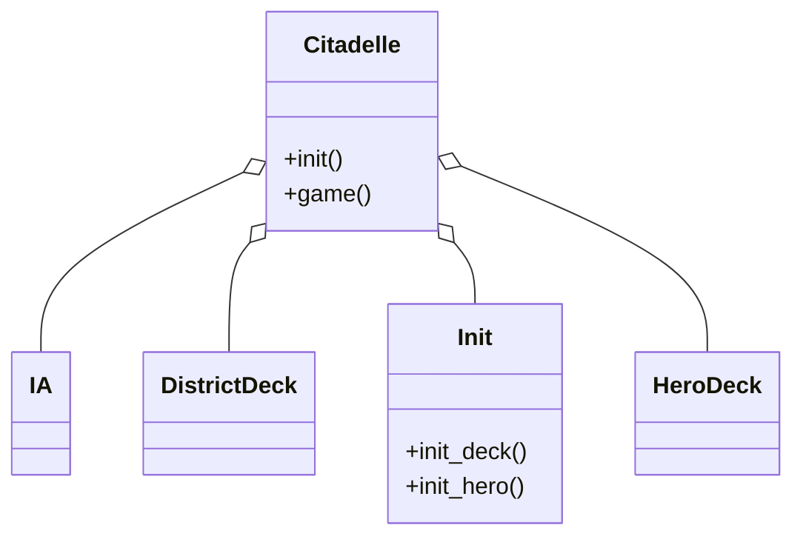

```mermaid

classDiagram
    Citadelle o-- IA
    Citadelle o-- DistrictDeck
    Citadelle o-- Init
    Citadelle o-- HeroDeck

            
    class Citadelle{
        +init()
        +game()
    }

    class IA{

    }

    class DistrictDeck{

    }

    class HeroDeck{

    }

    class Init{
        +init_deck()
        +init_hero()
    }

```